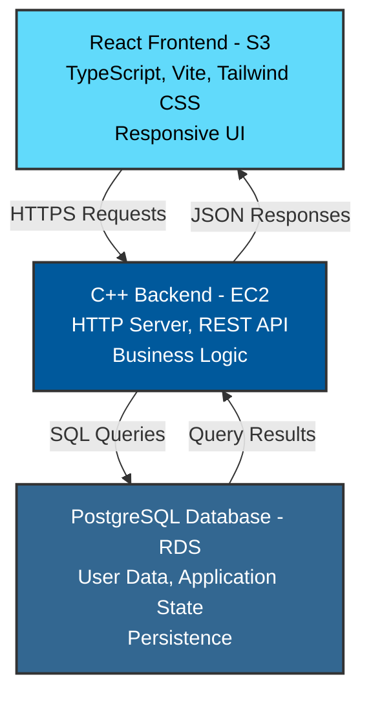

# Fullstack C++/React Template

A production-ready fullstack template combining a modern C++ backend with a React TypeScript frontend, containerized for AWS deployment.

## Project Overview

This template provides a complete setup for building scalable web applications using:

- **Backend**: C++ with HTTP library, PostgreSQL integration, and modern C++ features
- **Frontend**: React with TypeScript, Vite, and Tailwind CSS
- **Infrastructure**: Docker containerization with AWS deployment support
- **Database**: PostgreSQL with libpqxx ORM

## Architecture



## Prerequisites

### Local Development

- **C++ Development**:
  - GCC 9+ or Clang 10+
  - CMake or Premake5
  - PostgreSQL client libraries

- **Node.js Development**:
  - Node.js 18+ and npm/yarn
  - Git

- **Database**:
  - PostgreSQL 12+ running locally or via Docker

### AWS Deployment

- AWS Account with appropriate IAM permissions
- AWS CLI configured with credentials
- EC2 instance access (SSH key pair)
- RDS PostgreSQL instance
- S3 bucket for frontend hosting
- CloudFront distribution (optional but recommended)

## Local Setup

### 1. Backend Setup (C++)

```bash
# Clone the repository
git clone <repository-url>
cd Fullstack-Server-Template

# Install dependencies (Ubuntu/Debian)
sudo apt-get install libpq-dev postgresql-client-common

# Build the backend
premake5 gmake
cd build
make

# Run the backend server
./bin/server
# Server will start on http://localhost:8080
```

### 2. Frontend Setup (React)

```bash
# Navigate to frontend directory
cd front

# Install dependencies
npm install

# Start development server
npm run dev
# Frontend will be available at http://localhost:5173

# Build for production
npm run build

# Preview production build
npm run preview
```

### 3. Database Setup

```bash
# Connect to PostgreSQL
psql -U postgres

# Create database and tables
CREATE DATABASE fullstack_db;
\c fullstack_db

-- Example user table
CREATE TABLE users (
  id SERIAL PRIMARY KEY,
  username VARCHAR(255) UNIQUE NOT NULL,
  email VARCHAR(255) UNIQUE NOT NULL,
  created_at TIMESTAMP DEFAULT CURRENT_TIMESTAMP
);
```

### 4. Environment Configuration

Create a `.env` file in the project root for local development:

```env
# Backend
DB_HOST=localhost
DB_PORT=5432
DB_USER=postgres
DB_PASSWORD=your_password
DB_NAME=fullstack_db
SERVER_PORT=8080
SERVER_HOST=0.0.0.0

# Frontend
VITE_API_URL=http://localhost:8080
```

## API Usage

### Authentication Example

```bash
# Login endpoint
curl -X POST http://localhost:8080/api/auth/login \
  -H "Content-Type: application/json" \
  -d '{"username":"user","password":"pass"}'
```

### User Endpoints

```bash
# Get user profile
curl http://localhost:8080/api/users/profile \
  -H "Authorization: Bearer <token>"

# Update user profile
curl -X PUT http://localhost:8080/api/users/profile \
  -H "Authorization: Bearer <token>" \
  -H "Content-Type: application/json" \
  -d '{"email":"newemail@example.com"}'
```

## AWS Deployment

### Step 1: Prepare AWS Resources

#### Create RDS PostgreSQL Instance

```bash
# Create RDS instance via AWS CLI
aws rds create-db-instance \
  --db-instance-identifier fullstack-db \
  --db-instance-class db.t3.micro \
  --engine postgres \
  --master-username admin \
  --master-user-password <strong-password> \
  --allocated-storage 20 \
  --publicly-accessible false \
  --vpc-security-group-ids sg-xxxxxx
```

#### Create EC2 Instance

```bash
# Launch EC2 instance (Ubuntu 22.04 LTS)
aws ec2 run-instances \
  --image-id ami-0c55b159cbfafe1f0 \
  --instance-type t3.small \
  --key-name your-key-pair \
  --security-groups backend-sg
```

#### Create S3 Bucket

```bash
# Create S3 bucket for frontend
aws s3 mb s3://your-app-frontend

# Enable static website hosting
aws s3 website s3://your-app-frontend \
  --index-document index.html \
  --error-document index.html
```

### Step 2: Deploy Backend to EC2

```bash
# SSH into EC2 instance
ssh -i your-key.pem ubuntu@your-ec2-ip

# Install dependencies
sudo apt-get update
sudo apt-get install -y git build-essential libpq-dev

# Clone repository
git clone <repository-url>
cd Fullstack-Server-Template

# Build application
premake5 gmake
cd build
make

# Set environment variables
export DB_HOST=your-rds-endpoint.amazonaws.com
export DB_PORT=5432
export DB_USER=admin
export DB_PASSWORD=your-password
export DB_NAME=fullstack_db
export SERVER_PORT=8080

# Run backend (consider using systemd or supervisor for persistence)
./bin/server
```

### Step 3: Deploy Frontend to S3

```bash
# Build frontend
cd front
npm install
npm run build

# Deploy to S3
aws s3 sync dist/ s3://your-app-frontend --delete

# Invalidate CloudFront cache (if using CloudFront)
aws cloudfront create-invalidation \
  --distribution-id your-distribution-id \
  --paths "/*"
```

### Step 4: Configure CORS and API Gateway

Update backend CORS settings in `src/Services/UserService.cpp`:

```cpp
// Add CORS headers to all responses
server.set_post_data_handler([](const httplib::Request& req, httplib::Response& res) {
  res.set_header("Access-Control-Allow-Origin", "https://your-app-frontend");
  res.set_header("Access-Control-Allow-Methods", "GET, POST, PUT, DELETE");
  res.set_header("Access-Control-Allow-Headers", "Content-Type, Authorization");
});
```

## Docker Deployment

### Build Docker Image

```bash
docker build -t fullstack-app:latest .
```

### Run Container Locally

```bash
docker run -p 8080:8080 \
  -e DB_HOST=host.docker.internal \
  -e DB_PORT=5432 \
  -e DB_USER=postgres \
  -e DB_PASSWORD=your-password \
  -e DB_NAME=fullstack_db \
  fullstack-app:latest
```

### Push to ECR and Deploy to ECS

```bash
# Create ECR repository
aws ecr create-repository --repository-name fullstack-app

# Get login token
aws ecr get-login-password --region us-east-1 | \
  docker login --username AWS --password-stdin \
  <account-id>.dkr.ecr.us-east-1.amazonaws.com

# Tag and push image
docker tag fullstack-app:latest <account-id>.dkr.ecr.us-east-1.amazonaws.com/fullstack-app:latest
docker push <account-id>.dkr.ecr.us-east-1.amazonaws.com/fullstack-app:latest
```

## Project Structure

```
.
├── src/                          # C++ backend source
│   ├── Repositories/             # Database access layer
│   │   └── UserRepo.cpp
│   └── Services/                 # Business logic layer
│       └── UserService.cpp
├── include/                      # C++ headers
│   ├── Models/                   # Data models
│   ├── Repositories/             # Repository interfaces
│   └── Services/                 # Service interfaces
├── front/                        # React frontend
│   ├── src/
│   │   ├── api/                  # API integration
│   │   ├── components/           # React components
│   │   └── pages/                # Page components
│   ├── package.json
│   └── vite.config.ts
├── vendor/                       # Third-party libraries
│   ├── boost/                    # Boost C++ libraries
│   ├── httplib/                  # HTTP library
│   ├── libpqxx/                  # PostgreSQL client
│   └── nlohmann/                 # JSON library
├── Dockerfile                    # Container definition
├── premake5.lua                  # Build configuration
└── main.cpp                      # Backend entry point
```

## Performance Optimization

### Frontend Optimization

- Vite ensures fast build times and HMR during development
- Tailwind CSS provides optimized production builds
- Consider enabling gzip compression in S3

### Backend Optimization

- Use connection pooling for database connections
- Implement caching strategies for frequently accessed data
- Use async I/O where possible with httplib

### Infrastructure Optimization

- Enable CloudFront caching for static assets
- Use RDS read replicas for read-heavy workloads
- Implement auto-scaling for EC2 instances

## Security Considerations

- Keep all dependencies updated regularly
- Use environment variables for sensitive configuration
- Implement JWT token validation on backend
- Enable HTTPS/TLS for all communications
- Use security groups to restrict network access
- Implement rate limiting on API endpoints
- Validate and sanitize all user inputs
- Use secrets management (AWS Secrets Manager) for credentials

## Troubleshooting

### Backend Connection Issues

```bash
# Test PostgreSQL connection
psql -h your-rds-endpoint.amazonaws.com -U admin -d fullstack_db

# Check backend logs
journalctl -u fullstack-backend -f  # if using systemd
```

### Frontend Build Issues

```bash
# Clear node_modules and cache
rm -rf front/node_modules front/.vite
cd front && npm install
```

### CORS Issues

Ensure backend CORS headers are properly configured and match frontend origin.

## License

See LICENSE file for details.
